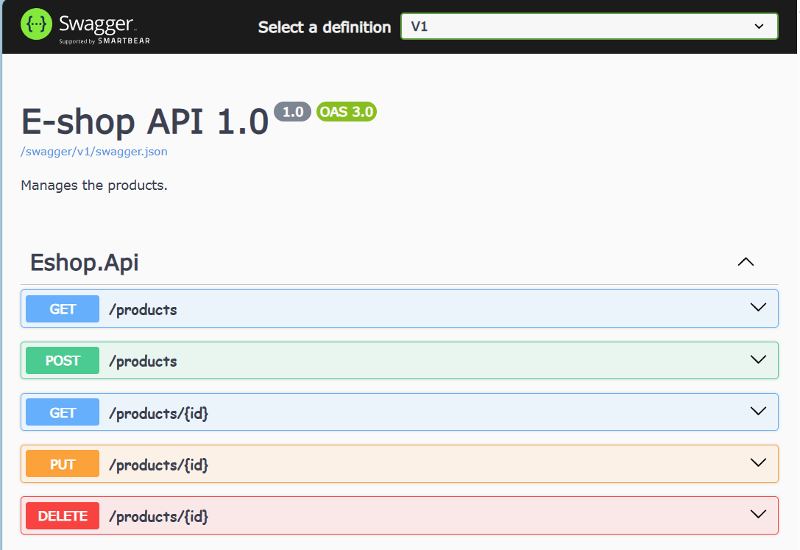
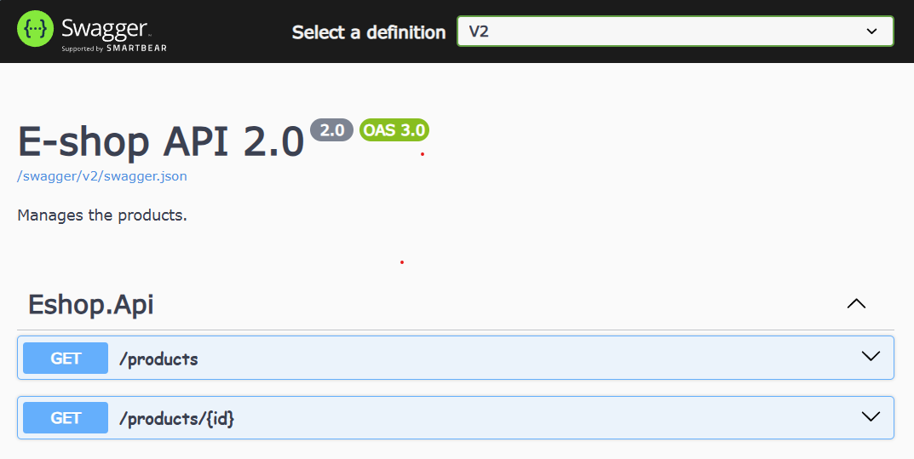

## E-Shop API Demo

A demo api built on the top of .net core 9 and minimal api

### Prerequisite

- Dotnet Core 9
- Visual Studio Code
  - C# Extension
  - Rest Client Extension
- Docker


### Starting SQL Server with Docker

```powershell
docker compose up -d sql
```


### Create user jwts for local test

```powershell
# create jwts for user with different role and permission

# Staff with read permission
dotnet user-jwts create --role Staff --scope "products:read"
# Update the token in the file `local-test.http`
# @STAFF_READ_TOKEN=<Staff Read Token>

# e.g.
# @STAFF_READ_TOKEN=eyJhbGciOiJIUxxxxxx.yyyyyy.zzzzz

# Staff with write permission
dotnet user-jwts create --role Staff --scope "products:write"
# Update the token in the file `local-test.http`
# @STAFF_WRITE_TOKEN=<Staff Write Token>

# Admin with read permission
dotnet user-jwts create --role Admin --scope "products:read"
# Update the token in the file `local-test.http`
# @ADMIN_READ_TOKEN=<Admin Read Token>

# Admin with write permission
dotnet user-jwts create --role Admin --scope "products:write"
# Update the token in the file `local-test.http`
# @ADMIN_WRITE_TOKEN=<Admin Write Token>

```

### Starting E-Shop  API

- Option 1: Run & Debug the E-Shop API from Visual Studio Code (F5)

- Option 2: Use command

    ```powershell
    cd <repository_location>
    dotnet run -p Eshop.Api --launch-profile https

    # info: Microsoft.EntityFrameworkCore.Migrations[20411]
    #   Acquiring an exclusive lock for migration application. See https://aka.ms/efcore-docs-migrations-lock # for more information if this takes too long.
    # info: Microsoft.EntityFrameworkCore.Migrations[20405]
    #     No migrations were applied. The database is already up to date.
    # info: DB Initializer[9]
    #     DB is ready!
    # info: Microsoft.Hosting.Lifetime[14]
    #     Now listening on: https://localhost:7236
    # info: Microsoft.Hosting.Lifetime[14]
    #     Now listening on: http://localhost:5117
    # info: Microsoft.Hosting.Lifetime[0]
    #     Application started. Press Ctrl+C to shut down.
    # info: Microsoft.Hosting.Lifetime[0]
    #    Hosting environment: Development
    ```


### Test E-Shop API via Rest Client

- Update the port in file `local-test.http` if you have a different port.
- Make sure tokens updated in file `local-test.http` as instructed above.
- Execute the POST requests first.
- Execute the GET requests. You will see some results as below.
  
```http
HTTP/1.1 200 OK
Connection: close
Content-Type: application/json; charset=utf-8
Date: Wed, 12 Mar 2025 14:23:11 GMT
Server: Kestrel
Transfer-Encoding: chunked

[
  {
    "id": 4,
    "name": "Anta Waffle Racer Crater",
    "genre": "Basket Shoes",
    "unitPrice": 22.88,
    "unitInStock": 12,
    "releaseDate": "2020-09-30T00:00:00",
    "imageUri": "https://dummyimage.com/200x200/eee/000"
  },
  {
    "id": 5,
    "name": "XTEP AntaCourt Royale",
    "genre": "Tennis Shoes",
    "unitPrice": 39.99,
    "unitInStock": 11,
    "releaseDate": "2021-09-30T00:00:00",
    "imageUri": "https://dummyimage.com/200x200/eee/000"
  }
]
```
 


### Swagger 

Access Swagger on browser
`https://localhost:<YOUR_API_PORT>/swagger/index.html`



<!--  -->
