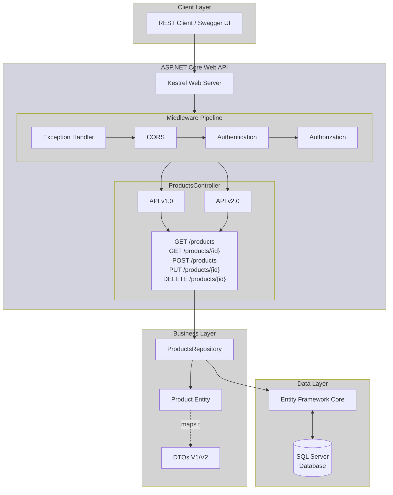

## E-Shop API Demo

A demo API built on top of .NET Core 8 with MVC API Controllers

### Architecture


```mermaid
flowchart TB
    subgraph Client["Client Layer"]
        HTTP[REST Client / Swagger UI]
    end

    subgraph API["ASP.NET Core Web API"]
        direction TB
        KESTREL[Kestrel Web Server]
        
        subgraph Middleware["Middleware Pipeline"]
            direction LR
            MW1[Exception Handler] --> MW2[CORS]
            MW2 --> MW3[Authentication]
            MW3 --> MW4[Authorization]
        end
        
        subgraph Controller["ProductsController"]
            direction TB
            V1[API v1.0]
            V2[API v2.0]
            ACTIONS["GET /products<br/>GET /products/{id}<br/>POST /products<br/>PUT /products/{id}<br/>DELETE /products/{id}"]
        end
        
        KESTREL --> Middleware
        Middleware --> V1 & V2
        V1 --> ACTIONS
        V2 --> ACTIONS
    end

    subgraph Business["Business Layer"]
        REPO[ProductsRepository]
        ENTITY[Product Entity]
        DTO[DTOs V1/V2]
    end

    subgraph Data["Data Layer"]
        EF[Entity Framework Core]
        DB[(SQL Server<br/>Database)]
    end

    HTTP --> KESTREL
    ACTIONS --> REPO
    REPO --> ENTITY
    ENTITY -.maps to.-> DTO
    REPO --> EF
    EF <--> DB

    style Client fill:#d3d3d3
    style API fill:#d3d3df
    style Middleware fill:#d3d3d3
    style Controller fill:#d3d3d3
    style Business fill:#d3d3d3
    style Data fill:#d3d3d3
```

#### Key Architectural Components

**🔐 Security Features**
- JWT Bearer token authentication
- Role-based authorization (Staff/Admin roles)
- Scope-based permissions (read/write access)
- CORS configuration for cross-origin requests

**📊 API Features**
- RESTful API design with CRUD operations
- API versioning (v1.0 and v2.0)
- Swagger/OpenAPI documentation
- Request/response logging
- Global exception handling
- Parameter validation

**💾 Data Management**
- Entity Framework Core ORM
- Code-first migrations
- Repository pattern implementation


### Prerequisite

- .NET 8 SDK
- Visual Studio Code
  - C# Extension
  - Rest Client Extension
- Docker

### Installing .NET 8 SDK

**Recommended: Using Scoop (Windows)**

[Scoop](https://scoop.sh/) is a command-line installer for Windows that makes it easy to install and manage multiple .NET SDK versions.

```powershell
# Install Scoop (if not already installed)
Set-ExecutionPolicy -ExecutionPolicy RemoteSigned -Scope CurrentUser
Invoke-RestMethod -Uri https://get.scoop.sh | Invoke-Expression

# Add the main bucket (if not already added)
scoop bucket add main

# Install .NET 8 SDK
scoop install dotnet8-sdk

# Verify installation
dotnet --version

# Install other version of .NET  SDK
scoop install dotnet10-sdk
```

**Benefits of using Scoop:**
- Easy side-by-side installation of multiple .NET versions
- Simple switching between SDK versions with `scoop reset dotnet8-sdk`
- No need for manual PATH configuration
- Clean uninstallation when needed

**Alternative: Direct Download**

Download and install from [Microsoft .NET Download](https://dotnet.microsoft.com/download/dotnet/8.0)


### Starting SQL Server with Docker

```powershell
docker compose up -d mssql-infra
```


### Scripts Organization

All project scripts are organized in the `scripts/` folder for better maintainability:

- **Build scripts:** `scripts/build.ps1` (Windows) and `scripts/build.sh` (Linux/macOS)
- **Test scripts:** `scripts/test.ps1` (Windows) and `scripts/test.sh` (Linux/macOS)
- **Database scripts:** `scripts/drop-db.ps1` (Windows)
- **Token generation:** `scripts/generate-jwt-tokens.ps1` (Windows)

### Create user jwts for local test via script (Recommended)

```powershell
.\scripts\generate-jwt-tokens.ps1
```

- The scripts will overwrite any existing token values in local-test.http
- If you need to regenerate tokens, simply run the script again
- The tokens are specific to your local development environment

### Create user jwts for local test (Manual)

```powershell
# Copying template file to local-test.http
copy -Force local-test-template.http local-test.http 

# create jwts for user with different role and permission

# Staff with read permission
dotnet user-jwts create --role Staff --scope "products:read"
# Update the token in the file `local-test.http`
# @STAFF_READ_TOKEN=<Staff Read Token>

# e.g.
# @STAFF_READ_TOKEN=eyJhbGciOiJIUxxxxxx.yyyyyy.zzzzz

# Staff with write permission
dotnet user-jwts create --role Staff --scope "products:write"
# Update the token in the file `local-test.http`
# @STAFF_WRITE_TOKEN=<Staff Write Token>

# Admin with read permission
dotnet user-jwts create --role Admin --scope "products:read"
# Update the token in the file `local-test.http`
# @ADMIN_READ_TOKEN=<Admin Read Token>

# Admin with write permission
dotnet user-jwts create --role Admin --scope "products:write"
# Update the token in the file `local-test.http`
# @ADMIN_WRITE_TOKEN=<Admin Write Token>

```

### Token Expiration

The generated JWT tokens have an expiration of approximately 90 days, making them suitable for extended testing periods.

### Starting E-Shop  API

> Eshop.Api project will create the database Eshop if it doesn't exist.

#### Building the project

**Windows (PowerShell):**

```powershell
# Build in Debug mode
.\scripts\build.ps1

# Clean and build
.\scripts\build.ps1 -Clean

# Build in Release mode
.\scripts\build.ps1 -Release
```

**Linux/macOS (Bash):**

```bash
# Make the script executable (first time only)
chmod +x scripts/build.sh

# Build in Debug mode
./scripts/build.sh

# Clean and build
./scripts/build.sh --clean

# Build in Release mode
./scripts/build.sh --release
```

**Or using dotnet CLI directly:**

```bash
dotnet build
```

#### Running the API

- Option 1: Run & Debug the E-Shop API from Visual Studio Code (F5)

- Option 2: Use command

    ```powershell
    cd <repository_location>
    dotnet run --project Eshop.Api --launch-profile https

    # info: Microsoft.EntityFrameworkCore.Migrations[20411]
    #   Acquiring an exclusive lock for migration application. 
    # See https://aka.ms/efcore-docs-migrations-lock 
    # for more information if this takes too long.
    # info: Microsoft.EntityFrameworkCore.Migrations[20405]
    #     No migrations were applied. The database is already up to date.
    # info: DB Initializer[9]
    #     DB is ready!
    # info: Microsoft.Hosting.Lifetime[14]
    #     Now listening on: https://localhost:7236
    # info: Microsoft.Hosting.Lifetime[14]
    #     Now listening on: http://localhost:5117
    # info: Microsoft.Hosting.Lifetime[0]
    #     Application started. Press Ctrl+C to shut down.
    # info: Microsoft.Hosting.Lifetime[0]
    #    Hosting environment: Development
    ```


### Test E-Shop API via Rest Client

- Update the port in file `local-test.http` if you have a different port.
- Make sure tokens updated in file `local-test.http` as instructed above.
- Execute the POST requests first.
- Execute the GET requests. You will see some results as below.
  
```http
HTTP/1.1 200 OK
Connection: close
Content-Type: application/json; charset=utf-8
Date: Wed, 12 Mar 2025 14:23:11 GMT
Server: Kestrel
Transfer-Encoding: chunked

[
  {
    "id": 4,
    "name": "Anta Waffle Racer Crater",
    "genre": "Basket Shoes",
    "unitPrice": 22.88,
    "unitInStock": 12,
    "releaseDate": "2020-09-30T00:00:00",
    "imageUri": "https://dummyimage.com/200x200/eee/000"
  },
  {
    "id": 5,
    "name": "XTEP AntaCourt Royale",
    "genre": "Tennis Shoes",
    "unitPrice": 39.99,
    "unitInStock": 11,
    "releaseDate": "2021-09-30T00:00:00",
    "imageUri": "https://dummyimage.com/200x200/eee/000"
  }
]
```
 
### Swagger 

Access Swagger on browser
`https://localhost:<YOUR_API_PORT>/swagger/index.html`


<!--  -->

### Running Tests

The project includes automated unit tests for the API controllers and repositories.

#### Using the test script (Recommended)

**Windows (PowerShell):**

```powershell
# Run all tests with build
.\scripts\test.ps1

# Run tests without rebuilding (faster)
.\scripts\test.ps1 -NoBuild

# Run specific tests using a filter
.\scripts\test.ps1 -Filter "GetProductV1*"

# Run tests with detailed output
.\scripts\test.ps1 -Detailed

# Run tests with code coverage
.\scripts\test.ps1 -Coverage

# Run tests with coverage (no build)
.\scripts\test.ps1 -NoBuild -Coverage

# Combine options
.\scripts\test.ps1 -NoBuild -Filter "GetAllProducts*" -Detailed
```

**Linux/macOS (Bash):**

```bash
# Make the script executable (first time only)
chmod +x scripts/test.sh

# Run all tests with build
./scripts/test.sh

# Run tests without rebuilding (faster)
./scripts/test.sh --no-build

# Run specific tests using a filter
./scripts/test.sh --filter "GetProductV1*"

# Run tests with detailed output
./scripts/test.sh --detailed

# Run tests with code coverage
./scripts/test.sh --coverage

# Run tests with coverage (no build)
./scripts/test.sh --no-build --coverage

# Combine options
./scripts/test.sh --no-build --filter "GetAllProducts*" --detailed
```

**Test script features:**
- Checks for and stops any running dotnet processes
- Switches to .NET 8 SDK (Windows: `scoop reset dotnet8-sdk`)
- Verifies the SDK version
- Runs the test suite
- Provides colored output and test summary
- **Generates HTML coverage reports** (with coverage flag)
  - Automatically installs ReportGenerator tool if needed
  - Creates detailed HTML report in `TestResults/CoverageReport/`
  - Shows coverage summary in console
  - Optionally opens report in browser

#### Using dotnet CLI directly

```bash
# Run all tests
dotnet test

# Run tests without building
dotnet test --no-build

# Run tests with detailed output
dotnet test --verbosity detailed

# Filter tests
dotnet test --filter "GetProductV1*"
```

### Drop the database

```powershell
.\scripts\drop-db.ps1
```